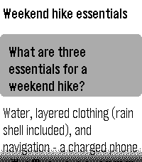

# permes

A Pebble watchapp for talking to a **Hermes agent** from the watch.
Speak on the watch (Pebble dictation, recognized by the phone app), the agent
runs on the host, and the reply is rendered on the watch. Multiple hermes
sessions = multiple parallel threads.

Target: every Pebble with a microphone — **Pebble Time 2 (emery)**,
**Pebble Round 2 (gabbro)**, **Pebble 2 Duo (flint)**, **Pebble 2 (diorite)**,
**Pebble Time (basalt)** and **Pebble Time Round (chalk)**; the primary
target remains emery (board "obelix", 200×228 color).

## Screenshots

| Platform | Threads | Conversation |
|---|---|---|
| emery (Time 2) |  |  |
| gabbro (Round 2) |  |  |
| flint (2 Duo) |  |  |
| diorite (Pebble 2) |  |  |
| basalt (Pebble Time) |  |  |
| chalk (Time Round) |  |  |

## Architecture

```
Watch (C)  ⇄  Phone (Pebble app, src/pkjs)  ⇄  HTTPS  ⇄  hermes api_server
            AppMessage (protocol.h)         https://<your-hermes-front>/
```

- **Watch side** (`src/c/`): launches straight into dictation for a new
  local draft; BACK from dictation returns to the thread screen and BACK
  again reveals the thread list (MenuLayer). Thread views use a ScrollLayer
  for replies, with SELECT starting dictation again.
- **Phone side** (`src/pkjs/index.js`): talks to hermes, polls async runs,
  cleans markdown, chunks replies for the watch.
- **hermes side**: gateway `api_server` platform (OpenAI-compatible REST),
  enabled in `~/.hermes/config.yaml` under `platforms.api_server` with a
  Bearer key. Set the URL and key from the app's gear/settings entry in the
  Pebble phone app; pkjs persists them in its local storage.

### hermes endpoints used

| Purpose | Endpoint |
|---|---|
| Thread list | `GET /api/sessions?limit=40` |
| New thread after its first message (untitled, with watch-sized system prompt) | `POST /api/sessions` |
| Generated topic after the first turn | `GET /api/sessions/{id}` |
| Latest reply when opening a thread | `GET /api/sessions/{id}/messages` |
| Send message (async turn) | `POST /v1/runs {input, session_id}` |
| Poll turn | `GET /v1/runs/{run_id}` → `status`, `output`, `error` |

Sessions persist server-side; `/v1/runs` with `session_id` continues the
thread's history automatically (validated).

### AppMessage protocol

See `src/c/protocol.h` (OP codes) and `messageKeys` in `package.json`
(`OP, THREAD_ID, TEXT, TITLE, INDEX, COUNT, STATUS, ACTIVE`). App launch and
**New thread** both open a local draft and start recording immediately; no
remote Hermes session is created until the first dictated message is
submitted. It then shows an interim `Watch [date
time]` label; after the first completed turn, Hermes' generated topic replaces
it on the watch. Replies travel
as ≤8 UTF-8-safe chunks of ≤440 bytes; the watch assembles them.

## Build & run

```sh
pebble build                        # builds emery + diorite + basalt + chalk
pebble install --emulator emery     # boots QEMU + pypkjs (real pkjs runtime!)
pebble logs --emulator emery        # C + pkjs logs
```

The same commands work with `--emulator gabbro|flint|diorite|basalt|chalk`
to test the other mic platforms in QEMU.

Screenshots never use real agent data: `tools/mock_hermes.py` serves canned
English threads on `127.0.0.1:8742` — point `config.local.js` at it (and
start it) before capturing.

On a phone, open the gear beside **permes**, enter the public HTTPS hermes URL
and Bearer key, then tap **Save**. The hosted page is
`permes/config/index.html`; pkjs handles `showConfiguration` and
`webviewclosed`, validates the response, and stores both values locally.

### Testing the full flow in QEMU (no mic on the emulator)

```sh
pebble emu-button click select --emulator emery   # start dictation on a thread
pebble transcribe "your message" --emulator emery # inject the transcription
pebble emu-button click select --emulator emery   # confirm → sends to hermes
pebble screenshot --no-open --emulator emery shot.png
```

### Pointing pkjs at a local hermes (QEMU testing)

When localStorage is empty (fresh emulator), pkjs falls back to the
gitignored `src/pkjs/config.local.js` (see `config.local.js.example`) —
edit it and rebuild to point pypkjs at any URL/key without the config page.
Values saved via the phone config page (localStorage) win when present.

Why not just use the public HTTPS front in QEMU? macOS Sequoia+
Local Network Privacy blocks *third-party* binaries (like pypkjs's uv
Python) from connecting to private/LAN IPs — connections die with
`EHOSTUNREACH` while system curl/nc work. Loopback is exempt, hence the
override. Real phones are unaffected (the Pebble app does the networking
with user-granted permissions). Alternatively grant Local Network access
in System Settings → Privacy & Security → Local Network to the app that
spawns the pebble tool.

## UX notes

- Launch and **New thread** start recording immediately; rejecting that
  dictation with BACK returns to the thread screen, and BACK again reveals
  the thread list.
- SELECT on a thread = speak; UP/DOWN scroll the reply; BACK to the list.
- Threads created from the watch get `system_prompt` asking for short,
  plain-text replies (watch-sized). Existing threads created outside the
  watch get markdown-stripped, truncated replies.
- Replies for the open thread render live; other threads keep running in
  parallel (pkjs polls each run; list shows "thinking..." via ACTIVE flag).
- A completed reply gives one short vibration only while its thread detail
  screen is visible; background threads and duplicate completion events are silent.
